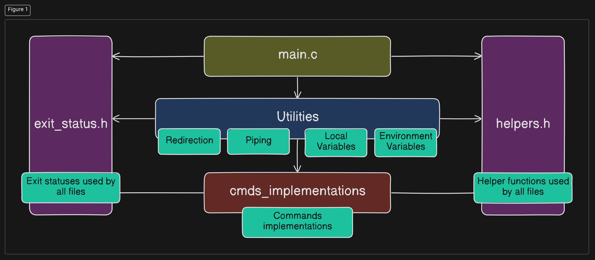

# Simple Shell Program

#### This repository contains a basic shell program written in C that interprets user input and translates it into commands where possible. The shell includes several built-in commands as detailed below.


#### The following image illustrates the structure of the program:



# Supported commands:

### 1. spwd: Prints the working directory.

### 2. secho: Prints a user-provided string to stdout.

    Example: echo Hello World

### 3. scp: Copies a file to another location.

    Usage: 
        cp {sourcePath} {targetPath}

    Notes:

        - The shell prints an error if the target file already exists.
        
        - If a target file name is provided, it will be used; otherwise, if only a target path is provided, the source file name will be used.
        
        - The -a option appends the source content to the end of the target file.

### 4. smv: Moves a file to another location.

    Usage: 
        mv {sourcePath} {targetPath}

    Notes:
        - The shell prints an error if the target file already exists.

        - If a target file name is provided, it will be used; otherwise, if only a target path is provided, the source file name will be used.

        - The -f option forces overwriting the target file if it exists.

### 5. scd: Change directory to the passed path
    Usage: scd {path}

### 6. senvir: Prints all the environment variables
    Notes:
        - if you passed the env name to the command, it will print that command alone.

### 7. stype: Prints the type of the command
    Usage: 
        stype {comand}

    types:
        * Internal
        * External
        * Unsupported

### 8. sphist: print The last 10 commands with their exit status

### 9. sexit: Prints "goodbye" and terminates the shell.

### 10. shelp: Prints all supported commands along with a brief description of each.

### 11. sfree: prints information about RAM.

### 12 suptime: prints the system's uptime and idle time.

<br></br>
# Additional features:

- The shell supports pressing Enter key similar to a real shell.
- The shell supports redirection of input, output and error.
- The shell supports multiple piping of commands.
- The shell supports pressing up and down arrows to navigate through commands history.

<br></br>

# Prerequisut:

```
sudo apt-get install libreadline-dev
```

# Compilation and Execution

To compile and run the program, use the following commands:
```
make
./output
```
<br></br>
# Output Samples:

### shelp, spwd, secho, scd and senvir:


<br></br>

### scp and smv


<br></br>

### sfree, suptime, stype, sphist


<br></br>

### Some External Commands:


<br></br>

### Variables


<br></br>

### Redirection


<br></br>

### Piping

